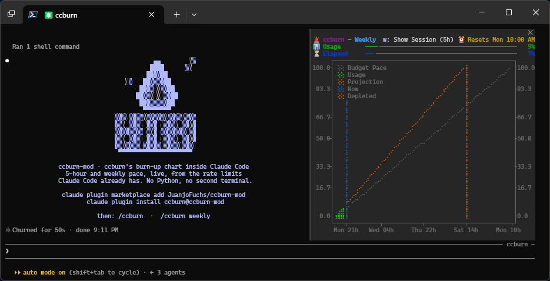

# 🔥 ccburn-mod

[](https://github.com/JuanjoFuchs/ccburn-mod/actions/workflows/ci.yml)
[](https://github.com/JuanjoFuchs/ccburn-mod/releases)
[](#install)
[](https://github.com/JuanjoFuchs/ccburn)
[](https://github.com/JuanjoFuchs/ccburn-mod/commits/main)
[](LICENSE)

<p align="center">
  
</p>

<p align="center">
  <strong>Watch your tokens burn, right where you spend them.</strong>
</p>

[ccburn](https://github.com/JuanjoFuchs/ccburn)'s burn-up chart, inside Claude Code: your 5-hour and weekly limits, your pace, and when you would run out, in a pane beside your conversation.

<p align="center">
  
</p>

## Install

```bash
claude plugin marketplace add JuanjoFuchs/ccburn-mod
claude plugin install ccburn@ccburn-mod
```

Then, in any Claude Code session:

```
/ccburn          # the 5-hour session window
/ccburn weekly   # the 7-day window
```

## Features

- **The real ccburn chart**: budget pace, your usage, the projection to the reset, Now and the moment you would run out. A TypeScript port held to ccburn's own output cell for cell by golden tests.
- **Pace at a glance**: 🧊 Cool. 🔥 On pace. 🚨 Too hot. Plus Usage and Elapsed gauges.
- **No setup**: Claude Code hands the mod its rate-limit readings, so there are no API calls, no credentials and nothing else to install.
- **History**: readings are kept between sessions, so the chart and the burn rate reach back past the current one.
- **Better with ccburn**: with [ccburn](https://github.com/JuanjoFuchs/ccburn) installed, the chart follows every session on your account, even while this one is idle (below).
- **Fits the room it gets**: docked full height beside the transcript in fullscreen mode, or inline above the prompt. The `w: Show Weekly` toggle sits in the title row.

## With ccburn installed

Claude Code only tells a session about its own replies, so on its own the pane's usage line moves when that session is working. If you also run [ccburn](https://github.com/JuanjoFuchs/ccburn) 0.8.0 or later with `ccburn collect` in your status line, ccburn records every session's readings, and the mod reads that history (`ccburn history --json`) once a minute: the chart then follows your whole account even while this session is idle. The mod also adds its own readings to ccburn's history through `ccburn collect`, so ccburn's chart benefits too. Turn it off with the `useCcburn` setting.

## Requirements

- A Claude Code build with mods (built against 2.1.289). The mod API is early access, so a future Claude Code release may need an update here.
- A **Pro, Max or Team** subscription. Claude Code reports no rate-limit windows for Enterprise or API accounts, so the pane says there is nothing to chart. For Enterprise monthly credits, use [ccburn](https://github.com/JuanjoFuchs/ccburn) itself.

## Settings

| Setting | Default | |
|---|---|---|
| `openOnStart` | `true` | Open the pane when a session starts. Claude Code only seats a pane nobody asked for on a wide terminal (144+ columns); otherwise run `/ccburn`. |
| `useCcburn` | `true` | Share history with the ccburn CLI when it is installed (see above). |

Change them in `/config` or with `claude plugin configure ccburn`.

## Development

```bash
claude --plugin-dir .        # run Claude Code with this checkout loaded (hot-reloads on save)
claude plugin validate .     # what the engine sees and would refuse
claude plugin test .         # unit, golden, pane and ccburn-sharing tests
```

The golden charts in `tests/fixtures/golden/` are rendered by the real ccburn. Regenerate them with ccburn checked out next to this repo:

```bash
PYTHONHASHSEED=0 ../ccburn/.venv/bin/python tools/make-goldens.py
```

Specs live in [`specs/`](specs/); agents start from [`AGENTS.md`](AGENTS.md).

## Related

- [ccburn](https://github.com/JuanjoFuchs/ccburn): the TUI and CLI this chart comes from.

## License

MIT
